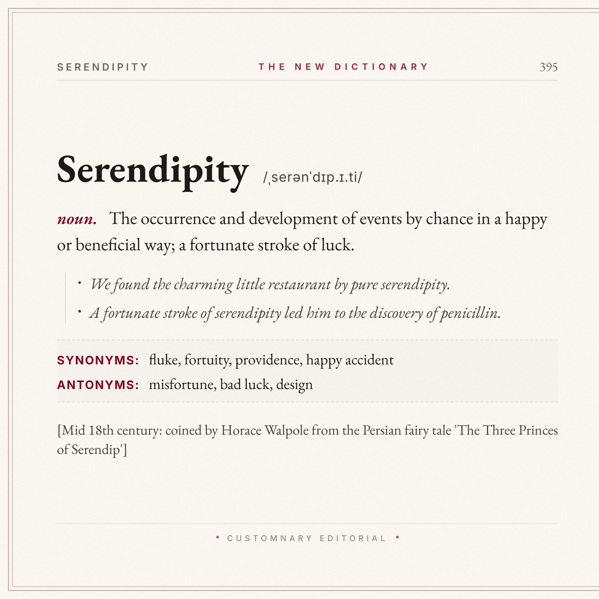

# What is Customnary?

*Preview of the default layout of the output* 
Customnary is a tool to make encyclopedia-esque word editor allowing you to make your own words and descriptions. Customnary runs locally or through GitHub Pages

## Features
- **Dynamic IPA translator**, allows you to manually turn your word into an phoentic translation i.e. /ˌserənˈdɪp.ɪ.ti/
- Multiple themes for finalizing the photo
- Ability to download the png and save it to your device at 3x resolution
- Many more customizable features
- Resizable image (1:1, 9:16, 3:4)
